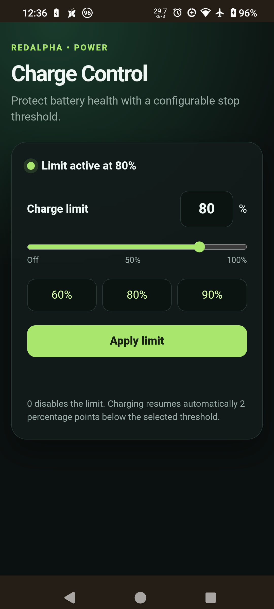

# RedAlpha Charge Control



KernelSU/ReSukiSU Manager module for the RedAlpha Poco F3 (`alioth`) kernel.
It provides a small WebUI for configuring the kernel's dedicated
`redalpha_charge_limit` interface.

## What it controls

- `0`: disable the limit and restore normal charging.
- `1..100`: stop charging at the selected battery percentage.
- Charging resumes automatically 2 percentage points below the limit.
- The setting is reapplied at boot from `/data/adb/redalpha-charge-control/limit`.

The module does not change charging current, float voltage, thermal levels,
JEITA, USB-PD, or safety controls. It requires the matching RedAlpha kernel;
it will show an error if `redalpha_charge_limit` is unavailable.

## Requirements

- Poco F3 / `alioth` running the RedAlpha kernel with the dedicated charge-limit ABI.
- ReSukiSU or compatible KernelSU Manager.
- Active KernelSU module support and a working metamodule where required.
- Root access.

## Install

1. Download the latest `redalpha-charge-control-*.zip` from [Releases](https://github.com/raz123/redalpha-charge-control/releases).
2. Open ReSukiSU Manager → Modules.
3. Choose **Install from storage** and select the ZIP.
4. Reboot Android to activate the module.
5. Open the module's play/WebUI button in ReSukiSU Manager.
6. Choose a preset or enter a percentage, then tap **Apply limit**.

`0%` disables the feature. The default after installation is disabled until a
limit is selected.

## Updating

Install the newer release ZIP through ReSukiSU Manager and reboot. The setting
file is preserved across module updates.

## Uninstall / recovery

Disable or uninstall the module from ReSukiSU Manager, then reboot. If a
module update is pending, reboot is required before the active files change.
The kernel feature is fail-safe: writing `0` to the dedicated interface clears
only the RedAlpha charge-limit vote.

## Development

The module is intentionally plain HTML/CSS/JavaScript. Validate locally with:

```sh
sh -n service.sh
unzip -t redalpha-charge-control-*.zip
```

GitHub Actions packages tagged releases and validates the WebUI bridge and
isolated ABI reference.

## License

GPL-3.0-or-later. See the upstream kernel repository for the kernel-side
license and source obligations.
